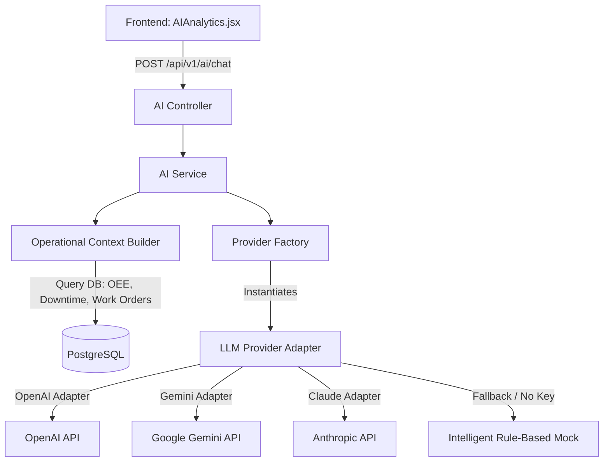
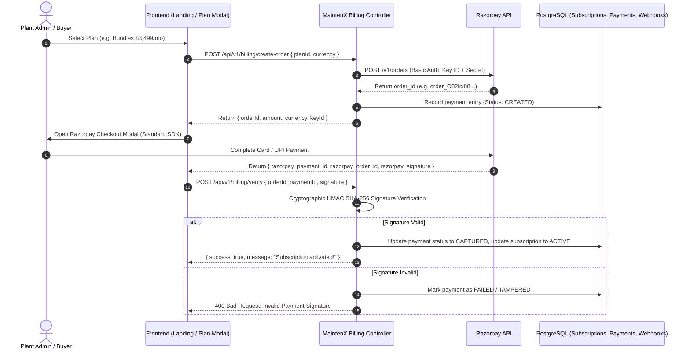
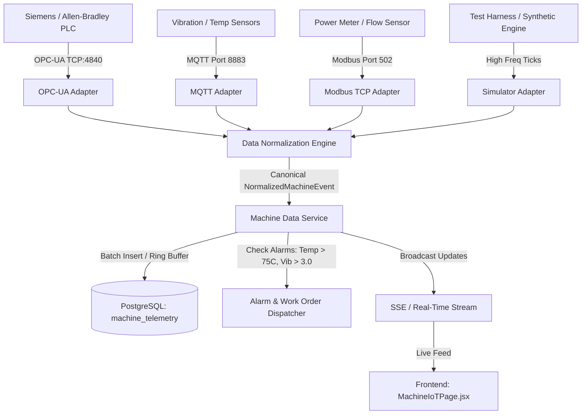

# MaintenX OS — External Integration Architecture Design
**Document ID:** MAINTENX-ARCH-3RD-PARTY-002  
**Target:** Production-Grade External Integrations (AI Assistant, Razorpay Billing, PLC / IoT Industrial Connectivity)  
**Date:** September 10, 2026  
**Status:** APPROVED ARCHITECTURAL SPECIFICATION  

---

## 1. Architectural Principles & Isolation Model

To ensure enterprise robustness, modularity, and zero leakage of third-party vendor code into core business logic, MaintenX OS strictly enforces the **Adapter & Inversion-of-Control Pattern**:

```
[External Provider / Protocol]
              │
              ▼
   [Integration Adapter]           <-- Isolates vendor quirks, SDKs, raw protocols
              │
              ▼
    [Data Normalizer]             <-- Maps into Canonical Internal Data Contracts
              │
              ▼
   [Integration Service]           <-- Validates, enforces business rules, handles persistence
              │
              ▼
  [MaintenX Core Domain / DB]      <-- Zero knowledge of external vendor details
```

---

## 2. Integration Area 1: AI Assistant Architecture

### 2.1 Provider Abstraction Model
The backend AI module avoids hard-coding any specific LLM provider. Providers are configured at runtime via environment variables:
* `AI_PROVIDER`: `openai` | `gemini` | `claude` | `mock` (default is `mock` if no key is provided).
* `AI_API_KEY`: Secrets kept strictly on backend; never exposed to frontend.
* `AI_MODEL`: Optional override (e.g. `gpt-4o-mini`, `gemini-1.5-flash`, `claude-3-5-sonnet-20241022`).



### 2.2 Operational Context Enrichment
Before invoking the LLM, the backend pulls a localized operational snapshot (tenant-isolated):
* Active Shift & Line Status (e.g. Line 1 Bottling running at 245 bpm).
* Live OEE metrics (Availability, Performance, Quality).
* Top active P1/P2 Work Orders and unresolved Downtime Incidents.
* Quality hold count and critical CCP limits.

This context is prepended as a **System Prompt**, restricting the LLM to verified plant operational data and preventing unsafe direct database write operations or hallucinations.

### 2.3 Security & Guardrails
1. **Timeout & Circuit Breaker:** Outbound LLM requests wrapped in an `AbortController` with a strict 15-second timeout.
2. **Safe Fallback:** If the external AI API fails (e.g. rate-limit 429, invalid key 401, network timeout), the service automatically falls back to internal operational heuristics without crashing or throwing 500.
3. **No Direct SQL Execution:** The LLM is strictly an analytical advisory assistant. It returns structured JSON / formatted recommendations.

---

## 3. Integration Area 2: Razorpay Billing Architecture

### 3.1 Flow & Ledger Architecture
Razorpay handles payment acceptance, while MaintenX OS maintains an immutable audit ledger in PostgreSQL:



### 3.2 Webhook Processing & Idempotency
Razorpay webhooks (`POST /api/v1/billing/webhook`) deliver asynchronous events (e.g. `payment.captured`, `payment.failed`, `subscription.charged`):
1. **Signature Verification:** The incoming payload raw body is verified against `x-razorpay-signature` using HMAC SHA-256 with `RAZORPAY_WEBHOOK_SECRET`.
2. **Idempotency Guard:** Every event has a unique Razorpay event ID (`event_xxx`). The service checks the `payment_webhooks` table. If `eventId` exists with status `PROCESSED`, the handler immediately returns `200 OK` without duplicating ledger entries.
3. **Database Transaction:** All state transitions (updating `payments` and `subscriptions`) are wrapped in PostgreSQL ACID transactions.

---

## 4. Integration Area 3: PLC / IoT & Industrial Connectivity

### 4.1 Protocol Adapter & Ingestion Pipeline
MaintenX OS receives telemetry from factory PLCs, edge brokers, and sensors across three primary industrial protocols:
* **OPC-UA:** Binary/TCP (Port 4840) communicating with industrial edge servers (e.g. Kepware, Beckhoff, Siemens S7-1500).
* **MQTT:** Lightweight pub/sub (Port 1883/8883) with Sparkplug B or standard JSON payloads from line sensors.
* **Modbus TCP:** Register-based polling (Port 502) for legacy PLCs, power meters, and RTUs.



### 4.2 Canonical Normalized Machine Event Contract
All incoming raw payloads are mapped into a standardized interface:
```typescript
export interface NormalizedMachineEvent {
  assetId: string;
  assetCode: string;
  timestamp: string; // ISO 8601
  status: "RUNNING" | "STOPPED" | "IDLE" | "MAINTENANCE";
  productionCount: number;
  speed: number;        // Units per minute / bpm
  cycleTime: number;    // Seconds
  downtime: number;     // Accumulated downtime in minutes
  faultCode?: string;   // e.g. "E-04" or "JAM-01"
  alarm?: string;       // Human-readable alarm text
  source: "OPC_UA" | "MQTT" | "MODBUS" | "SIMULATOR";
  metrics: {
    vibration?: number;   // mm/s RMS
    temperature?: number; // Celsius
    pressure?: number;    // Bar
    rpm?: number;         // Revolutions per min
    powerKW?: number;     // Active power kW
    flowRate?: number;    // L/h
  };
  rawPayload?: Record<string, any>;
}
```

### 4.3 Simulator & Mock Hardware Isolation
To ensure the system is completely functional and testable without requiring physical factory floor hardware:
* A built-in `SimulatorAdapter` emits realistic factory line cycles (sinusoidal speed, realistic vibration harmonics with stochastic micro-spikes, temperature equilibration, and periodic mock micro-stops).
* Can be started/stopped on-demand via REST API (`/api/v1/iot/simulator/start`).
* When real factory edge gateways are deployed, their endpoints are plugged directly into the `OpcUaAdapter` or `MqttAdapter` without modifying any UI or database logic.

---

## 5. Security & Operational Guardrails Summary

| Vector | Guardrail Mechanism |
| :--- | :--- |
| **API Secrets** | Stored strictly in backend `.env`; never sent over network to frontend. `.env.example` provides safe templates. |
| **Webhook Spoofing** | HMAC SHA-256 cryptographic verification of `x-razorpay-signature` against raw request body. |
| **Replay Attacks** | Unique `eventId` deduplication in `payment_webhooks` table. |
| **Industrial Ingestion DOS** | Edge ingestion endpoint rate-limited to 5,000 req/min per gateway; telemetry stored in indexed time-partitioned table. |
| **LLM Hallucination** | System prompt anchored with ground-truth DB metrics; LLM granted read-only context with zero write privileges. |

---

## 6. Verification & Test Strategy

1. **Automated Unit & API Testing:**
   * AI endpoint tests: prompt validation, provider selection, timeout handling, fallback when key missing.
   * Razorpay endpoint tests: order creation, signature verification algorithm test, webhook replay test.
   * IoT endpoint tests: ingestion of OPC-UA, MQTT, Modbus payloads, normalization verification, telemetry query.
2. **Regression Testing:**
   * Verify all existing 15 modules continue to function.
   * Ensure TypeScript compilation (`npx tsc --noEmit`) and Vite build (`npm run build`) pass with zero errors.
