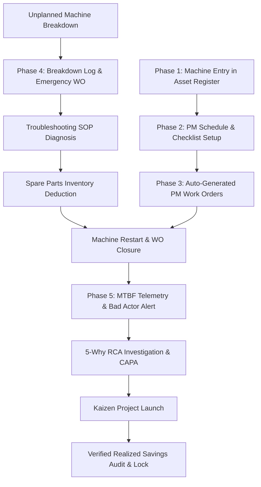

# 🏭 MaintenX-OS — Manufacturing Operating System & CMMS
## Comprehensive A-to-Z System Architecture, Workflow Lifecycle & Wireframe Blueprint

> **Document Version:** 2.0.0 (Updated & Complete Master Specification)  
> **Target Audience:** Engineers, Product Managers, AI Assistants (ChatGPT/Claude), and System Architects.  
> **Platform Summary:** MaintenX-OS is an enterprise-grade Smart Manufacturing Operating System integrating **CMMS (Computerized Maintenance Management System)**, **EAM (Enterprise Asset Management)**, and **Continuous Improvement (CI / Kaizen / RCA-CAPA OS)** into a unified real-time operational cloud.

---

# 📑 TABLE OF CONTENTS
1. [Core Platform Architecture & Tech Stack](#1-core-platform-architecture--tech-stack)
2. [The 4 Primary Dashboards & User Roles](#2-the-4-primary-dashboards--user-roles)
3. [End-to-End A-to-Z Operational Lifecycles](#3-end-to-end-a-to-z-operational-lifecycles)
   - [Phase 1: Machine Entry & Asset Master Setup](#phase-1-machine-entry--asset-master-setup-asset-lifecycle)
   - [Phase 2: Maintenance Setup & PM Scheduling](#phase-2-maintenance-setup--pm-scheduling)
   - [Phase 3: Daily PM Execution & Work Order Flow](#phase-3-daily-pm-execution--work-order-flow)
   - [Phase 4: Unplanned Breakdown & Reactive Repair](#phase-4-unplanned-breakdown--reactive-repair-flow)
   - [Phase 5: RCA, CAPA & Continuous Improvement (Kaizen)](#phase-5-rca-capa--continuous-improvement-kaizen)
4. [Complete Sidebar Navigation & Module Route Matrix](#4-complete-sidebar-navigation--module-route-matrix)
5. [Complete Button-by-Button & Screen Functional Spec](#5-complete-button-by-button--screen-functional-spec)
6. [Data Pipeline & State Architecture](#6-data-pipeline--state-architecture)
7. [Directory Tree & Codebase Map](#7-directory-tree--codebase-map)

---

# 1. Core Platform Architecture & Tech Stack

```
+-----------------------------------------------------------------------------------+
|                            MAINTENX-OS TECHNICAL STACK                            |
+-----------------------------------------------------------------------------------+
| • Frontend Core:     React 18 (Vite Bundler, ES Modules)                          |
| • Styling System:    Vanilla CSS Design Tokens (Warm Industrial Cream Theme)      |
| • State Management:  React Context API (Auth, CMMS, App, Role, Exceptions)        |
| • Persistence:       Browser LocalStorage Auto-Sync & Session Recovery            |
| • Icons & Graphics:  Lucide React Icons + Custom SVG Telemetry Gauges             |
| • Routing:           React Router v6 with RoleProtectedRoute Route Guards         |
| • Export Formats:    Direct CSV Client-side Generation & CSS Print Media PDF Engine|
+-----------------------------------------------------------------------------------+
```

---

# 2. The 4 Primary Dashboards & User Roles

```
                                  👑 4 DASHBOARDS ECOSYSTEM
                                  
  ┌─────────────────────────┐                     ┌─────────────────────────┐
  │ 1. MAINTENANCE HUB      │                     │ 2. PLANT COMMAND CENTER │
  │ Role: Technician/Lead   │                     │ Role: Plant Manager     │
  │ Focus: Repair & PMs     │                     │ Focus: OEE & Line Status│
  └────────────┬────────────┘                     └────────────┬────────────┘
               │                                               │
               ▼                                               ▼
  ┌─────────────────────────┐                     ┌─────────────────────────┐
  │ 3. CI / ENGINEERING     │                     │ 4. SYSTEM ADMIN CONSOLE │
  │ Role: CI Lead/Reliability│                    │ Role: IT / Compliance   │
  │ Focus: Kaizen & Savings │                     │ Focus: Hierarchy & Users│
  └─────────────────────────┘                     └─────────────────────────┘
```

### 🛠️ Dashboard 1: Maintenance Dashboard (`/dashboards/maintenance`, `/maintenance`)
* **Target User:** Maintenance Lead, Shift Technician, Millwright (*Marcus Vance*).
* **Core Goal:** Keep machines running, execute PM checklists, triage breakdowns, consume spare parts.
* **Top KPIs:** Active Work Orders, Critical Breakdowns, PM Compliance %, Low Stock Spare Parts.

### 🏭 Dashboard 2: Plant Manager Command Center (`/`, `/dashboards/plant-manager`)
* **Target User:** Plant Manager, Operations Director, Production Head (*Sarah Jenkins*).
* **Core Goal:** Real-time production output, live line status (Running/Down/Idle), overall plant OEE.
* **Top KPIs:** Fleet OEE %, Daily Output vs Target, Total Downtime Hours, Active Line Alarms.

### 📈 Dashboard 3: CI / Engineering & Reliability Hub (`/ci/*`, `/dashboards/ci-engineering`)
* **Target User:** Continuous Improvement Manager, Kaizen Lead, Reliability Engineer (*Alexander Vance*).
* **Core Goal:** Eliminate recurring breakdowns (Bad Actors), run 5-Why/8D investigations, track Kaizen ROI.
* **Top KPIs:** Fleet MTBF (Mean Time Between Failures), Fleet MTTR, Realized YTD Savings ($), Open Capex Projects.

### 🔒 Dashboard 4: System Admin Console (`/admin/*`, `/dashboards/admin`)
* **Target User:** System Administrator, Plant IT Lead, Compliance Auditor (*Elena Rostova*).
* **Core Goal:** Enterprise tree structure, user role permissions, ISO 22000/50001 audit logs.
* **Top KPIs:** Total Active Users, System Telemetry Health, Security Audit Logs, ERP Sync State.

---

# 3. End-to-End A-to-Z Operational Lifecycles



---

### Phase 1: Machine Entry & Asset Master Setup (Asset Lifecycle)
1. **Who Performs:** Maintenance Lead (`maintenance`) or System Admin (`admin`).
2. **Where to Navigate:** 
   - Maintenance Role: Sidebar $\rightarrow$ `CMMS` $\rightarrow$ `Asset 360°` (`/assets/register` or `/maintenance/assets`).
   - Admin Role: Sidebar $\rightarrow$ `Master Data` $\rightarrow$ `Work Centers` / `Machine Capability`.
   - Global Shortcut: Header Top Bar $\rightarrow$ **`+ Fast Action`** button $\rightarrow$ "Register Asset".
3. **Data Input Fields:**
   - `Asset Code / ID`: Unique ID (e.g. `AST-PST-01`).
   - `Machine Name`: e.g. `HTST Pasteurizer — Line 1`.
   - `Plant Hierarchy`: Enterprise $\rightarrow$ Plant 1 $\rightarrow$ Processing Bay $\rightarrow$ Line 1.
   - `Criticality Rating`: `Critical` (Class A), `High` (Class B), `Medium` (Class C).
   - `Technical Meta`: Make, Model, Serial Number, Commission Date, Nameplate kW/RPM.
   - `Linked BOM Spares`: Bearings, mechanical seals, servo motors associated with this machine.
4. **Result:** Machine is live in **Asset 360**, initial health index set to 100%, and becomes selectable across PM, Breakdowns, and IoT telemetry.

---

### Phase 2: Maintenance Setup & PM Scheduling
1. **Who Performs:** Maintenance Planner / Supervisor.
2. **Where to Navigate:** Sidebar $\rightarrow$ `Preventive Maintenance` $\rightarrow$ `PM Scheduling` (`/preventive/schedules` or `/maintenance/pm-schedules`).
3. **Process:**
   - Click **`+ Create PM Schedule`** button.
   - Select Target Asset: `HTST Pasteurizer — Line 1`.
   - Set Cadence: Time-based (Daily/Weekly/Monthly/Quarterly) or Meter-based (Every 500 Operating Hours).
   - Attach Standard Inspection Checklist items (e.g. *Inspect steam seals, verify thermistor calibration, grease drive bearings*).
   - Link Standard Consumables (Grease tube, food-grade gasket kit).
4. **Result:** PM schedule is active. When due, the cron auto-dispatches an assigned Work Order.

---

### Phase 3: Daily PM Execution & Work Order Flow
1. **Who Performs:** Shift Maintenance Technician (*Marcus Vance*).
2. **Where to Navigate:** Sidebar $\rightarrow$ `Work Orders` (`/workorders` or `/maintenance/work-orders`).
3. **Execution Steps:**
   - Technician logs in, views their **Work Queue Table**.
   - Clicks **`Start Work Order`** $\rightarrow$ Status changes to `In Progress`, active work timer begins.
   - Performs physical inspection on shop floor, ticks off digital checklist checkboxes, enters empirical readings (e.g. Temperature: `74.2 °C`).
   - Clicks **`Complete Work Order`** $\rightarrow$ Status moves to `Completed`.
4. **Result:** PM Compliance KPI increases, machine last-serviced date updates, next PM auto-schedules.

---

### Phase 4: Unplanned Breakdown & Reactive Repair Flow
1. **Machine Stops on Production Line:**
   - Operator logs breakdown in `Breakdowns` $\rightarrow$ `Breakdown Log` (`/breakdowns/log`).
   - Selects machine `Rotary Filler — Line 1`, selects Failure Code `MECH-SEAL-01`, adds notes.
   - Plant Manager Command Center line indicator flips from 🟢 Running to 🔴 **DOWN**.
2. **Emergency WO Dispatch:**
   - System auto-generates P1 Emergency Work Order assigned to on-duty technician.
3. **Troubleshooting Expert SOP Engine (`/troubleshooting`):**
   - Technician searches symptom (`Nozzle volumetric dosing error`).
   - System displays verified root causes, step-by-step LOTO safety lockout guide, and exact replacement part (`SEAL-VT-08`).
4. **Spare Parts Auto-Deduction (`/spareparts/inventory`):**
   - Technician issues part $\rightarrow$ Inventory decreases by 1, unit cost is allocated to machine cost ledger.
5. **Repair Closure & Line Restart:**
   - Technician restarts line, clicks **`Close Breakdown`**.
   - Downtime clock stops, calculates Downtime Duration (45 mins) and updates MTTR telemetry.
   - Line on Plant Manager Dashboard returns to 🟢 **RUNNING**.

---

### Phase 5: RCA, CAPA & Continuous Improvement (Kaizen)
1. **Who Performs:** CI Manager / Reliability Lead (*Alexander Vance*).
2. **Where to Navigate:** Sidebar $\rightarrow$ `CI Projects` & `Reliability` (`/ci/*`).
3. **Process:**
   - **Reliability Insights (`/ci/reliability`):** Identifies machines with repeat failure count $\ge 2$. Clicks **`Initiate RCA →`**.
   - **5-Why / 8D Investigation (`/ci/rca/*`):** Performs root-cause analysis with the cross-functional team.
   - **Action Items (`/ci/projects/actions`):** Assigns CAPA corrective actions with owner and due date.
   - **Kaizen Realized Savings (`/ci/projects/savings` & `/ci/projects/benefits`):** Calculates annual cost avoidance. Plant Manager clicks **`Verify & Lock`** to certify savings.
   - **Engineering Capex (`/ci/engineering`):** If permanent fix requires equipment redesign, logs Capex project with budget and P&ID spec dossier.

---

# 4. Complete Sidebar Navigation & Module Route Matrix

| Role | Sidebar Group | Navigation Item | Route URL | Purpose |
| :--- | :--- | :--- | :--- | :--- |
| **Maintenance** | CMMS | Dashboard | `/maintenance` | Fleet active repair queue & MTTR |
| **Maintenance** | CMMS | Asset 360° | `/maintenance/assets` | Master machine list & health index |
| **Maintenance** | CMMS | Work Orders | `/maintenance/work-orders` | Work Order Kanban & table |
| **Maintenance** | CMMS | PM Scheduling | `/maintenance/pm-schedules` | Preventive maintenance planner |
| **Maintenance** | CMMS | Breakdowns | `/maintenance/breakdowns` | Unplanned downtime logs |
| **Maintenance** | CMMS | Troubleshooting | `/maintenance/troubleshooting` | Symptom-to-solution SOP engine |
| **Maintenance** | CMMS | Spare Parts | `/maintenance/spare-parts` | Stock levels, bins, reorder points |
| **Maintenance** | CMMS | Calibration | `/maintenance/calibration` | ISO instrument calibration logs |
| **Plant Manager**| Operations | Command Center | `/` or `/command-center` | Plant line status & live OEE |
| **Plant Manager**| Operations | Production | `/production` | Batch run-rate & shift targets |
| **Plant Manager**| Operations | Quality Holds | `/quality` | Quarantine & release approvals |
| **CI Engineer** | CI Projects | Projects List | `/ci/projects/list` | Kaizen & DMAIC project ledger |
| **CI Engineer** | CI Projects | Project Actions | `/ci/projects/actions` | Task sprint items & owners |
| **CI Engineer** | CI Projects | Savings Tracker | `/ci/projects/savings` | Projected vs Realized financial ROI |
| **CI Engineer** | CI Projects | Benefits Audit | `/ci/projects/benefits` | Statistical savings lock |
| **CI Engineer** | Engineering | Standards Library | `/ci/standards` | Controlled SOPs & HACCP limits |
| **CI Engineer** | Engineering | Engineering Capex | `/ci/engineering` | Machine modification capex |
| **CI Engineer** | Telemetry | Reliability Insights | `/ci/reliability` | Fleet MTBF / MTTR analytics |
| **CI Engineer** | Reporting | Reports Hub | `/ci/reports` | Printable audit digests |
| **Admin** | Master Data | Work Centers | `/master-data/work-centers`| Factory plant & line hierarchy |
| **Admin** | Security | Users & Roles | `/admin/users` | Permissions & user onboarding |

---

# 5. Complete Button-by-Button & Screen Functional Spec

### 🔘 Top Header Action Buttons
* **`Global Search Bar` (`Search size={15}`):** Live real-time multi-field search filtering across IDs, names, symptom codes, and owners. Contains no placeholder text for clean UI.
* **`+ Fast Action` Button:** Quick-modal drawer to launch an emergency breakdown log or new work order from any screen.
* **`🔔 Notifications Bell`:** Slide-over drawer showing temperature threshold breaches, low stock alerts, and overdue PMs.
* **`User Profile Avatar (C)`:** Switcher allowing instant simulation login across the 11 platform roles.

### 🔘 CI Module Action Buttons
* **`+ Initiate Project` (`/ci/projects/list`):** Opens clean popup modal to register a new Kaizen project.
* **`+ Log Action Item` (`/ci/projects/actions`):** Opens modal to assign task deliverable with target due date and engineer.
* **`Mark Complete` Button:** Instant state transition toggling action item status between Open and Complete.
* **`Verify Benefits` (`/ci/projects/savings`):** Direct navigation shortcut to the financial validation audit screen.
* **`Verify & Lock` (`/ci/projects/benefits`):** Digitally locks the verified cost savings record with green badge.
* **`+ Author Standard` (`/ci/standards`):** Modal to publish controlled engineering standard or HACCP SOP.
* **`+ Log Capex Project` (`/ci/engineering`):** Modal to register plant modification or capital expenditure initiative.
* **`Initiate RCA →` (`/ci/reliability`):** Direct workflow handoff launching 5-Why investigation for repeat failure assets.
* **`Print / Export PDF` (`/ci/reports`):** Uses selective CSS print media queries (`.print-only`, `.no-print`) to generate high-resolution PDF audit dossiers.
* **`Export CSV` Buttons:** Generates RFC 4180 compliant CSV files with automated timestamped file naming.

---

# 6. Data Pipeline & State Architecture

```
+-----------------------------------------------------------------------------------+
|                            STATE & DATA ARCHITECTURE                              |
+-----------------------------------------------------------------------------------+
|                                                                                   |
|  [ STATE LAYER ]                                                                  |
|  ├── AuthContext / RoleContext   👉 Current active role, permissions, login state |
|  ├── CMMSContext                 👉 Assets, Work Orders, PMs, Spares, Breakdowns  |
|  └── AppContext                  👉 Toast alerts, Global search, Drawer state     |
|                                                                                   |
|  [ PERSISTENCE LAYER (LocalStorage) ]                                             |
|  ├── flowstate_auth              👉 Session authentication state                  |
|  ├── flowstate_current_role      👉 Active user persona ID                        |
|  ├── flowstate_work_orders       👉 Real-time WO state & parts deduction          |
|  └── flowstate_assets            👉 Fleet machine health telemetry                |
+-----------------------------------------------------------------------------------+
```

---

# 7. Directory Tree & Codebase Map

```
MaintenX-OS/
├── index.html                                  # Root HTML shell
├── package.json                                # React, Vite, Lucide dependencies
├── vite.config.js                              # Vite build pipeline
├── wireframe.md                                # This master system blueprint
├── src/
│   ├── main.jsx                                # Application entry point
│   ├── index.css                               # Unified industrial theme & design tokens
│   ├── App.jsx                                 # Master router & RoleProtectedRoute
│   ├── context/                                # State providers
│   │   ├── AppContext.jsx                      # App-wide toasts & search state
│   │   ├── RoleContext.jsx                     # 11 Roles & navigation configs
│   │   ├── CMMSContext.jsx                     # Core maintenance data models
│   │   └── AuthContext.jsx                     # User authentication
│   ├── components/
│   │   ├── common/                             # Reusable UI widgets
│   │   │   ├── Badge.jsx, Button.jsx, Card.jsx, StatCard.jsx, Modal.jsx
│   │   └── layout/                             # Shell layout
│   │       ├── Header.jsx                      # Fast action top bar & search
│   │       └── Sidebar.jsx                     # Dynamic role-based navigation sidebar
│   └── pages/                                  # Module page views
│       ├── dashboards/                         # 4 Executive role dashboards
│       ├── maintenance/                        # CMMS maintenance screens
│       ├── breakdowns/                         # Downtime logs & financial impact
│       ├── assets/                             # Asset 360 & hierarchy
│       ├── spareparts/                         # Inventory & bin locations
│       ├── calibration/                        # Instrument compliance
│       ├── troubleshooting/                    # Expert SOP diagnosis engine
│       └── ci/                                 # Continuous Improvement & Kaizen
│           ├── CIProjects.jsx                  # /ci/projects/list
│           ├── ProjectActions.jsx              # /ci/projects/actions
│           ├── Savings.jsx                     # /ci/projects/savings
│           ├── BenefitsVerification.jsx        # /ci/projects/benefits
│           ├── Standards.jsx                   # /ci/standards
│           ├── Engineering.jsx                 # /ci/engineering
│           ├── ReliabilityInsights.jsx         # /ci/reliability
│           └── Reports.jsx                     # /ci/reports
```

---

## 🎯 Verification & Build Integrity
* **Build Command:** `npm run build`
* **Test Verification:** Clean build with `0 errors` (`dist/assets` bundle verified).
* **Code Standard:** Complete reactive filtering, `useMemo` search optimizations, modal form encapsulations, and clean header typography without redundant subtitle text.
