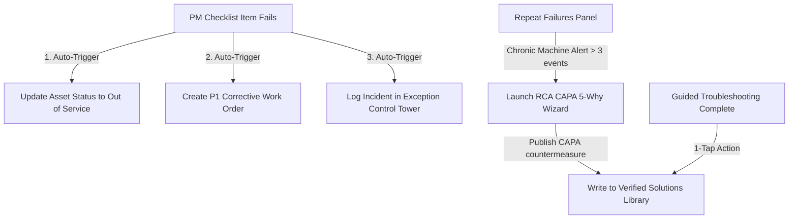

# FlowState Ops Manufacturing OS - A to Z Wireframe & Architecture Blueprint

This document details the complete system design, screen wireframes, data models, and connected business logic implemented for the **FlowState Ops Manufacturing Operating System**.

---

## 📂 1. Directory Tree & System Map

The codebase is organized in a modular structure to isolate mock datasets, React Context state providers, reusable visualization charts, layout wrappers, and page views.

```
d:/kiaan projects/MaintenX OS/
├── index.html                           # Root HTML, sets fonts (Inter & JetBrains Mono)
├── package.json                         # Client dependencies (React, Router, Lucide, Confetti)
├── src/
│   ├── main.jsx                         # Main React mount point
│   ├── index.css                        # Industrial design system CSS (Tokens, layout, scrollbars)
│   ├── App.jsx                          # Main router overlay & RoleProtectedRoute guards
│   │
│   ├── context/                         # State management & LocalStorage syncing
│   │   ├── AppContext.jsx               # Plant/Shift filters, Toast, Search drawer, QR scanner
│   │   ├── RoleContext.jsx              # 11 role profiles, permissions, defaultRoute redirection, path permissions
│   │   ├── CMMSContext.jsx              # Assets list, Work Orders, PMs, Spare Parts, Calibrations
│   │   ├── ProductionContext.jsx        # Orders, batches, shift handoffs
│   │   ├── QualityContext.jsx           # Quality inspections, CCPs, deviations & holds
│   │   └── InventoryContext.jsx         # Warehouse lots, bin transfers, warehouse capacity
│   │
│   ├── components/
│   │   ├── common/                      # Reusable components
│   │   │   ├── Badge.jsx, Button.jsx, Card.jsx, StatCard.jsx
│   │   │   ├── Modal.jsx, Drawer.jsx, Stepper.jsx, Tabs.jsx
│   │   │   ├── QRModal.jsx, GlobalSearchModal.jsx, QuickActionDrawer.jsx
│   │   └── charts/                      # SVG components
│   │       ├── OEEGauges.jsx, SparkLine.jsx, BarChart.jsx, AreaChart.jsx
│   │       ├── ParetoChart.jsx, GanttTimeline.jsx, TraceabilityNodeGraph.jsx
│   │
│   └── pages/                           # Application Pages & Dashboards
│       ├── auth/
│       │   └── Login.jsx                # Login screen with 11 Roles Visual Card Grid
│       ├── PlaceholderPage.jsx          # Professional fallback screen for pending backend modules
│       ├── dashboards/
│       │   ├── CommandCenter.jsx        # Real-time telemetry & OEE gauge matrix
│       │   ├── OEEPerformance.jsx      # Availability/Performance/Quality analysis
│       │   ├── KPIAnalytics.jsx        # Finance, quality & safety scorecards
│       │   ├── AIAnalytics.jsx         # AI agent recommendations & Q&A chatbot
│       │   ├── ExceptionControlTower.jsx # P1-P4 triage incidents
│       │   └── MaintenanceDashboard.jsx # CMMS main fleet dashboard
│       ├── maintenance/
│       │   ├── AssetList.jsx, Asset360.jsx
│       │   ├── WorkOrderList.jsx, WorkOrderDetail.jsx, CreateWorkOrder.jsx
│       │   ├── PMScheduleList.jsx, PMChecklistList.jsx, PMChecklistExecute.jsx
│       │   ├── BreakdownList.jsx, BreakdownDetail.jsx, TroubleshootingWizard.jsx
│       │   ├── VerifiedSolutions.jsx, RepeatFailures.jsx, ReliabilityAnalytics.jsx
│       │   ├── SparePartsInventory.jsx, CalibrationCenter.jsx, FailureCodes.jsx
│       ├── production/
│       │   └── ProductionDashboard.jsx  # MES batches and shift handoffs
│       ├── planning/
│       │   └── PlanningDashboard.jsx    # APS scheduler Gantt and MRP
│       ├── quality/
│       │   └── QualityDashboard.jsx     # CCP check logs and quarantine holds
│       ├── inventory/
│       │   └── InventoryDashboard.jsx   # Receiving, warehouse zones and bin moves
│       ├── traceability/
│       │   └── Batch360Traceability.jsx # Genealogy graph and mock recall simulator
│       ├── costing/
│       │   └── CostingAnalytics.jsx     # Spend variance and ERP tags
│       ├── rca/
│       │   └── RCACAPAWizard.jsx        # 5-Why analysis stepper
│       ├── labour/
│       │   └── LabourTrainingMatrix.jsx # Competency matrices and rosters
│       └── shopfloor/
│           └── MobileShopFloorHub.jsx   # Mobile fast-action dashboard for operators
```

---

## 🗄️ 2. State & Database Layer (LocalStorage Sync)

All data variables synchronize inside the browser's `localStorage` so edits, status transitions, and dispatches persist across reloads.

| LocalStorage Key | Context Hook | Data Schema |
| :--- | :--- | :--- |
| `flowstate_auth` | `useRole()` | Boolean: `true` / `false` |
| `flowstate_current_role` | `useRole()` | Object: Current active role ID, default route |
| `flowstate_assets` | `useCMMS()` | Array: Asset health index, SCADA telemetry values |
| `flowstate_work_orders` | `useCMMS()` | Array: Work order details, assigned technician, parts, cost |
| `flowstate_pm_schedules` | `useCMMS()` | Array: Recurrence schedule, checklist references |

---

## 💻 3. Dynamic Sidebar Navigation Matrix (11 Roles)

The navigation menu and default routes are driven dynamically by the active role via `NAVIGATION_CONFIG`:

| # | Role | Default Route | Permitted Menu Items (Sidebar) |
|---|---|---|---|
| 1 | **Line Operator** | `/shopfloor` | Shopfloor HMI, My Tasks (Placeholder), PM Checklists |
| 2 | **Line Lead** | `/production/line-dashboard` | **Production**: Line Dashboard (Placeholder), Shift Report (Placeholder), Escalations; **Quality**: Escalations |
| 3 | **Supervisor** | `/production/operations-dashboard` | **Production**: Operations Dashboard (Placeholder), Shift Plan (Placeholder), Shift Report (Placeholder); **Labour**: Resource Matrix; **CMMS**: Work Orders |
| 4 | **Planner / Scheduler** | `/planning` | **Planning**: Planning Dashboard, Schedule, MRP; **CMMS**: PM Scheduling, Work Orders |
| 5 | **Warehouse / Receiver** | `/inventory` | **Inventory**: Warehouse Dashboard, Receiving, Picking; **CMMS**: Spare Parts |
| 6 | **Quality / QA** | `/quality` | **Quality**: Quality Dashboard, Holds, CCP; **CMMS**: Calibration |
| 7 | **Maintenance** | `/maintenance` | **CMMS**: Dashboard, Asset 360°, Work Orders, PM Scheduling, PM Checklists, Breakdowns, Troubleshooting, Spare Parts, Calibration, Failure Codes, Maintenance KPIs, Repeat Failures, Verified Solutions |
| 8 | **CI / Engineering** | `/engineering/dashboard` | **CMMS**: Dashboard, Maintenance KPIs, Repeat Failures, Verified Solutions, RCA Integration; **Analytics**: Reliability Analytics |
| 9 | **Plant Manager** | `/command-center` | **Dashboards**: Command Center; Production; Quality; Inventory; Labour; CMMS Dashboard; Reports |
| 10 | **Executive** | `/executive/portfolio` | **Dashboards**: Executive Portfolio (Placeholder); Reports |
| 11 | **System Administrator** | `/admin/console` | **Settings**: Admin Console (Placeholder), Users (Placeholder), Roles & Permissions (Placeholder), System Configuration (Placeholder), Devices / Integrations (Placeholder) |

---

## ⚡ 4. Integrated System Logic (Cross-Module Workflows)

FlowState Ops uses automated backend connections to simulate operational activities:



---

## 🔍 5. Route Protection & Placeholders

1. **RoleProtectedRoute**: Compares `location.pathname` with the current role's allowed paths. Unauthorized access renders a premium **"Access Restricted"** warning card.
2. **PlaceholderPage**: All routes that do not have active dashboards in this phase (e.g. `/admin/users`, `/executive/portfolio`, etc.) point to a unified visual placeholder explaining that the screen is scheduled for Phase 4.
