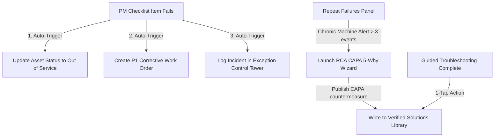

# FlowState Ops Manufacturing OS - A to Z Wireframe & Architecture Blueprint

This document details the complete system design, screen wireframes, data models, and connected business logic implemented for the **FlowState Ops Manufacturing Operating System**.

---

## 📂 1. Directory Tree & System Map

The codebase is organized in a modular structure to isolate mock datasets, React Context state providers, reusable visualization charts, layout wrappers, and page views.

```
d:/kiaan projects/MaintenX OS/
├── index.html                           # Root HTML, sets fonts (Inter & JetBrains Mono)
├── package.json                         # Client dependencies (React, Router, Lucide, Confetti)
├── src/
│   ├── main.jsx                         # Main React mount point
│   ├── index.css                        # Industrial design system CSS (Tokens, layout, scrollbars)
│   ├── App.jsx                          # Main router overlay & RoleProtectedRoute guards
│   │
│   ├── context/                         # State management & LocalStorage syncing
│   │   ├── AppContext.jsx               # Plant/Shift filters, Toast, Search drawer, QR scanner
│   │   ├── RoleContext.jsx              # 12 role profiles, permissions, login/logout states
│   │   ├── CMMSContext.jsx              # Assets list, Work Orders, PMs, Spare Parts, Calibrations
│   │   ├── ProductionContext.jsx        # Orders, batches, shift handoffs
│   │   ├── QualityContext.jsx           # Quality inspections, CCPs, deviations & holds
│   │   └── InventoryContext.jsx         # Warehouse lots, bin transfers, warehouse capacity
│   │
│   ├── data/                            # Static Mock Datasets (initial values)
│   │   ├── mockAssets.js
│   │   ├── mockWorkOrders.js
│   │   ├── mockPMSchedules.js
│   │   ├── mockChecklists.js
│   │   ├── mockBreakdowns.js
│   │   ├── mockSolutions.js
│   │   ├── mockFailureCodes.js
│   │   ├── mockSpareParts.js
│   │   ├── mockCalibration.js
│   │   ├── mockReliability.js
│   │   ├── mockProduction.js
│   │   ├── mockPlanning.js
│   │   ├── mockQuality.js
│   │   ├── mockInventory.js
│   │   ├── mockTraceability.js
│   │   ├── mockCosting.js
│   │   ├── mockLabour.js
│   │   ├── mockPurchasing.js
│   │   ├── mockDocuments.js
│   │   └── mockReports.js
│   │
│   ├── components/
│   │   ├── common/                      # Reusable components
│   │   │   ├── Badge.jsx, Button.jsx, Card.jsx, StatCard.jsx
│   │   │   ├── Modal.jsx, Drawer.jsx, Stepper.jsx, Tabs.jsx
│   │   │   ├── QRModal.jsx, GlobalSearchModal.jsx, QuickActionDrawer.jsx
│   │   ├── tables/
│   │   │   └── DataTable.jsx            # Search, filter, sorting, pagination, CSV export
│   │   └── charts/                      # SVG components
│   │       ├── OEEGauges.jsx, SparkLine.jsx, BarChart.jsx, AreaChart.jsx
│   │       ├── ParetoChart.jsx, GanttTimeline.jsx, TraceabilityNodeGraph.jsx
│   │
│   └── pages/                           # Application Pages & Dashboards
│       ├── auth/
│       │   └── Login.jsx                # Login screen with Visual Role Card Grid
│       ├── dashboards/
│       │   ├── CommandCenter.jsx        # Real-time telemetry & OEE gauge matrix
│       │   ├── OEEPerformance.jsx      # Availability/Performance/Quality analysis
│       │   ├── KPIAnalytics.jsx        # Finance, quality & safety scorecards
│       │   ├── AIAnalytics.jsx         # AI agent recommendations & Q&A chatbot
│       │   ├── ExceptionControlTower.jsx # P1-P4 triage incidents
│       │   └── MaintenanceDashboard.jsx # CMMS main fleet dashboard
│       ├── maintenance/
│       │   ├── AssetList.jsx, Asset360.jsx
│       │   ├── WorkOrderList.jsx, WorkOrderDetail.jsx, CreateWorkOrder.jsx
│       │   ├── PMScheduleList.jsx, PMChecklistList.jsx, PMChecklistExecute.jsx
│       │   ├── BreakdownList.jsx, BreakdownDetail.jsx, TroubleshootingWizard.jsx
│       │   ├── VerifiedSolutions.jsx, RepeatFailures.jsx, ReliabilityAnalytics.jsx
│       │   ├── SparePartsInventory.jsx, CalibrationCenter.jsx, FailureCodes.jsx
│       ├── production/
│       │   └── ProductionDashboard.jsx  # MES batches and shift handoffs
│       ├── planning/
│       │   └── PlanningDashboard.jsx    # APS scheduler Gantt and MRP
│       ├── quality/
│       │   └── QualityDashboard.jsx     # CCP check logs and quarantine holds
│       ├── inventory/
│       │   └── InventoryDashboard.jsx   # Receiving, warehouse zones and bin moves
│       ├── traceability/
│       │   └── Batch360Traceability.jsx # Genealogy graph and mock recall simulator
│       ├── costing/
│       │   └── CostingAnalytics.jsx     # Spend variance and ERP tags
│       ├── rca/
│       │   └── RCACAPAWizard.jsx        # 5-Why analysis stepper
│       ├── labour/
│       │   └── LabourTrainingMatrix.jsx # Competency matrices and rosters
│       ├── purchasing/
│       │   └── PurchasingSupplierHub.jsx # PO creation and supplier scorecards
│       ├── documents/
│       │   └── DocumentSOPLibrary.jsx   # Active SOP library
│       ├── reports/
│       │   └── ReportsCenter.jsx        # Print-ready reporting center
│       └── shopfloor/
│           └── MobileShopFloorHub.jsx   # Mobile fast-action dashboard
```

---

## 🗄️ 2. State & Database Layer (LocalStorage Sync)

All data variables synchronize inside the browser's `localStorage` so edits, status transitions, and dispatches persist across reloads.

| LocalStorage Key | Context Hook | Data Schema |
| :--- | :--- | :--- |
| `flowstate_auth` | `useRole()` | Boolean: `true` / `false` |
| `flowstate_current_role` | `useRole()` | Object: Current active role ID, default defaultRoute |
| `flowstate_assets` | `useCMMS()` | Array: Asset health index, SCADA telemetry values |
| `flowstate_work_orders` | `useCMMS()` | Array: Work order details, assigned technician, parts, cost |
| `flowstate_pm_schedules` | `useCMMS()` | Array: Recurrence schedule, checklist references |
| `flowstate_breakdowns` | `useCMMS()` | Array: Active and resolved breakdown downtime incidents |
| `flowstate_verified_solutions` | `useCMMS()` | Array: Diagnostic checklists for repeat failure prevention |
| `flowstate_exceptions` | `useExceptions()` | Array: Control Tower notifications (P1-P4 tickets) |

---

## 💻 3. Screen-by-Screen Wireframe Mapping

### 🔑 3.1 Authentication & Shell
#### [Login.jsx](file:///d:/kiaan%20projects/MaintenX%20OS/src/pages/auth/Login.jsx)
- **Top Bar**: FLOWSTATE Logo, ISO 27001 Security Label.
- **Form Inputs**: Username (`admin@flowstate.ops`), Password (`••••••••`).
- **Visual Role Grid Selector**: 12 custom cards (2 columns/3 columns). Selecting a card applies a blue border and checkmark.
- **Sign In Button**: Calls `login(selectedRole)`.

#### [Sidebar.jsx](file:///d:/kiaan%20projects/MaintenX%20OS/src/components/layout/Sidebar.jsx) & [Header.jsx](file:///d:/kiaan%20projects/MaintenX%20OS/src/components/layout/Header.jsx)
- **Collapsible Sidebar**: Fits navigation links with icon highlights. Redundant links are hidden via `canAccessModule` filters.
- **Footer**: Displays selected role initial. Includes a red **Sign Out** button that triggers a toast and resets the session.
- **Header**: Contains Breadcrumbs, Plant filter selector, Active Shift badge, Global Search bar, and a fast-action quick drawer trigger.

---

### 📊 3.2 Core Dashboards (A to Z)

#### 1. CommandCenter.jsx (Command Center Dashboard)
- **Telemetry Ticker**: Real-time ticker showing speed, vibration, and temperature metrics for Line 1 and Line 2.
- **OEE Gauges Matrix**: Gauge displays for Availability, Performance, Quality, and overall plant OEE.
- **Exception Ticker**: Red scrolling banner displaying P1 hardware alerts.
- **Action Links**: Direct navigation to OEE details, Exceptions, and MES.

#### 2. OEEPerformance.jsx (OEE & Speed Analytics)
- **Six Big Losses Card**: Displays scrap, idle, micro-stops, breakdowns, startup reject, and cycle time metrics.
- **Pareto Loss Chart**: Displays downtime minutes and contribution percentages.
- **Line Matrix**: Telemetry comparison showing target speed vs. actual speed.

#### 3. KPIAnalytics.jsx (Enterprise KPI Scorecards)
- **Multi-Pillar KPIs**: Scorecard widgets for Safety, Quality, Delivery, Cost, and Morale.
- **Date Filter**: Select daily, shift-based, or monthly intervals.
- **Performance Graph**: Displays trend rates over time.

#### 4. AIAnalytics.jsx (AI Decision Support)
- **AI Recommendation Stream**: Recommendations tagged with `FACT`, `CALCULATION`, `ESTIMATE`, or `AI RECOMMENDATION`. Includes 1-click **Approve** and **Reject** action buttons.
- **Interactive Chatbot**: Chat input with scrollable history and predefined prompts.

#### 5. ExceptionControlTower.jsx (Exceptions Control Tower)
- **Triage Queue**: Displays P1 (Immediate Dispatch) to P4 (Monitor) issues.
- **Quick Action Drawer**: Actions to **Assign Technician**, **Escalate to Supervisor**, or **Resolve Issue**.

#### 6. MaintenanceDashboard.jsx (CMMS Dashboard)
- **Maintenance KPIs**: Widgets displaying MTBF, MTTR, PM compliance, and active corrective work orders.
- **Fleet Asset List**: Health indicators showing status from 100% (Normal) to 30% (Critical).

#### 7. ProductionDashboard.jsx (MES Portal)
- **Active Orders Queue**: Order progress bars showing target vs. actual counts.
- **Recipe Inspector**: Verified ingredient batch list matching GS1 barcodes.
- **Shift Handoff Log**: Interactive form to sign over shifts.

#### 8. PlanningDashboard.jsx (APS & MRP Scheduler)
- **APS Gantt Chart**: Interactive timeline displaying job sequences, changeover times, and CIP cleanouts.
- **MRP Shortage List**: Net projected ingredient deficit table with a 1-click **Generate PO** action.

#### 9. QualityDashboard.jsx (QMS Inspection)
- **CCP Logging Form**: Input fields for Brix sugar levels, pH, and seal burst pressure.
- **Hold Quarantine Log**: Quarantine list for out-of-spec pallets. Includes disposition options to **Authorize Rework** or **Scrap Pallet**.

#### 10. InventoryDashboard.jsx (WMS Dashboard)
- **Warehouse capacity**: Visual heat map cards showing occupancy rates for raw materials and finished goods.
- **Receiving Form**: Form to receive deliveries and generate QR barcodes.
- **Location Transfer Modal**: Option to move lots between storage racks.

---

### 🔧 3.3 Core CMMS Sub-Pages

#### [Asset360.jsx](file:///d:/kiaan%20projects/MaintenX%20OS/src/pages/maintenance/Asset360.jsx) (Asset 360° Profile)
An 8-tab profile view for a selected machine:
- **Telemetry**: Real-time vibration, pressure, and temperature sparklines.
- **Work Orders**: History of corrective and preventative work orders.
- **PM Checklists**: Scheduled inspections.
- **Breakdowns**: Breakdown timeline.
- **Spare Parts BOM**: Linked part list showing bin locations.
- **Calibration**: NIST traceability metrics.
- **Verified Solutions**: Problem-solving procedures.
- **OEM Manuals**: Active PDF drawings.

#### [PMChecklistExecute.jsx](file:///d:/kiaan%20projects/MaintenX%20OS/src/pages/maintenance/PMChecklistExecute.jsx) (Checklist Run Panel)
- **Inspect Checklist**: Checklist items with **PASS / FAIL / N/A** buttons.
- **Measurement Input**: Number fields with target specification tags (e.g. `Brix Limit: 11.5 - 12.1`).
- **Check Failed Workflow Modal**: Triggered immediately when any check is marked as `FAIL`. Includes action buttons to auto-generate a corrective work order or update the asset status.

#### [TroubleshootingWizard.jsx](file:///d:/kiaan%20projects/MaintenX%20OS/src/pages/maintenance/TroubleshootingWizard.jsx) (7-Step Wizard)
- Uses a step-by-step progress component.
- Steps include: Symptom, Diagnostic Tests, Evidence, Root Cause, Repair Action, Post-Test, and Verification.
- Saving options: Save as draft or publish to the verified solutions database.

---

## ⚡ 4. Integrated System Logic (Cross-Module Workflows)

FlowState Ops uses automated backend connections to simulate operational activities:



---

## 🔍 5. Page Layout Architecture

All screens follow a structured UI layout for consistency:

```
+-------------------------------------------------------------------------+
|  Logo  |  Breadcrumbs   Shift/Plant Filter  Search  Role-Switcher  User  |
+--------+----------------------------------------------------------------+
|        |                                                                |
|  Nav   |  +----------------------------------------------------------+  |
|  Item  |  | Page Header: Title, Subtitle, Action Buttons             |  |
|  Item  |  +----------------------------------------------------------+  |
|  Item  |  |                                                          |  |
|        |  |  +----------------------------------------------------+  |  |
|  Sub-  |  |  | KPI Tickers / Stat Cards                           |  |  |
|  Item  |  |  +----------------------------------------------------+  |  |
|  Sub-  |  |                                                          |  |
|  Item  |  |  +--------------------------+  +-----------------------+ |  |
|        |  |  | Analytics / SVG Chart    |  | Work List / Data Grid | |  |
|        |  |  +--------------------------+  +-----------------------+ |  |
|        |  +----------------------------------------------------------+  |
|  Logout|                                                                |
+--------+----------------------------------------------------------------+
```
